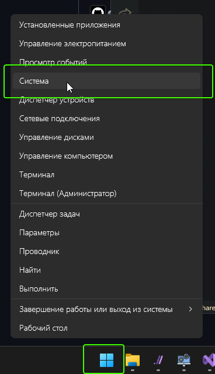
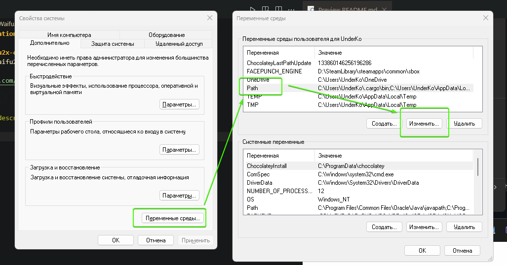
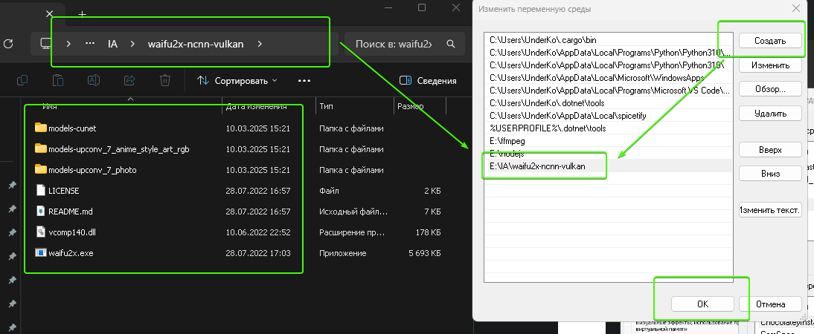
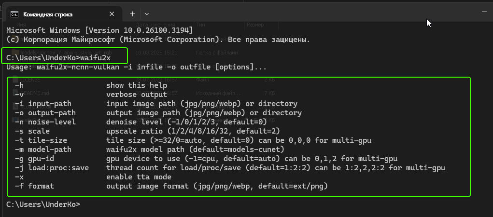
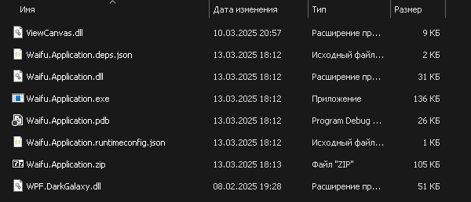
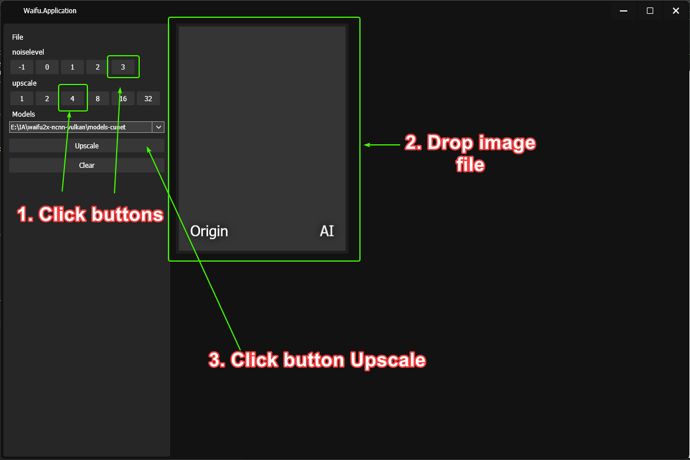

# Waifu.Application

# install waifu2x-console
1. Downlaod "waifu2x-ncnn-vulkan-windows.zip"
```
https://github.com/nihui/waifu2x-ncnn-vulkan
```

2. Open System 



3. Variable environments => path => change 



4. Append new path  




# Test startup waifu2x-console

1. Open cmd 
2. Write 
```
waifu2x-ncnn-vulkan
```
3. Cool!



# Open application 
```
Waifu.Application.exe
```



